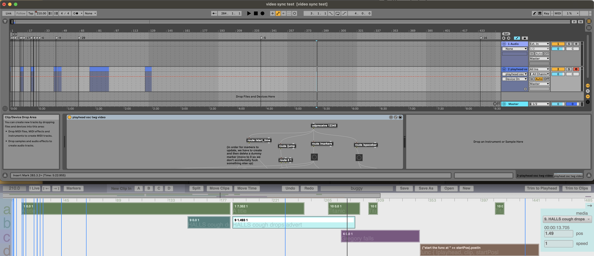

# VideoTimeline
Timeline for video clips and SC code that runs in sync with Ableton Live timeline.

1. Install max4live patch and open it in a dummy MIDI track.
2. Run the following SuperCollider code:

```supercollider
VideoTimeline.newProject("Untitled");
```



You have to click the "Markers" button to make the markers sync with Ableton's.

## Key commands

| Key | Effect |
| ----|--------|
|space|play / pause|
|delete|delete selected clips|
|alt-arrow| move between markers |
|cmd-alt-arrow|move to selection start/stop|
|cmd-Z|undo|
|cmd-shift-Z|redo|
|cmd-S|save|
|cmd-shift-S|save as|
|cmd-O|open|
|cmd-N|new|
|cmd-E|split selected clips at playhead|
|cmd-A|select all clips|
|alt-drag|select clips on all buses|
|shift-click|add to selection / remove from selection|
|cmd-alt-L|hide/show inspector|
|cmd-1 - cmd-4|new clip on bus a - d|
